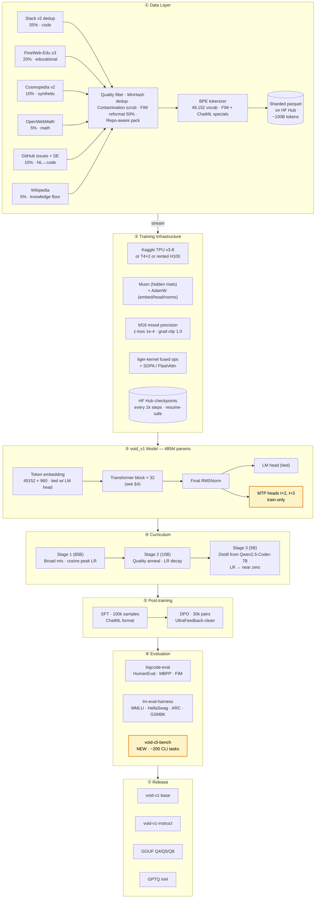
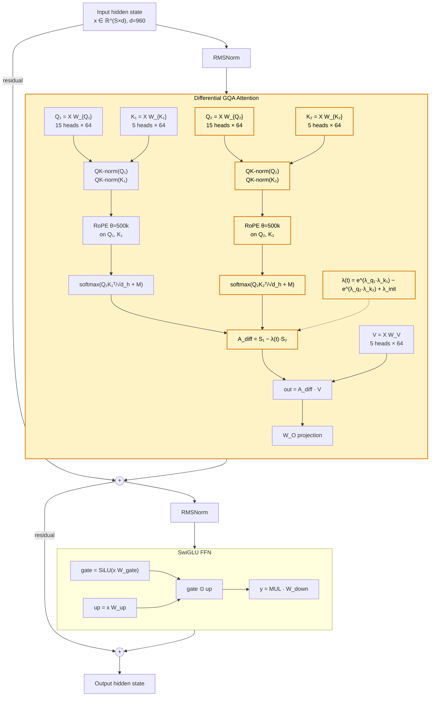
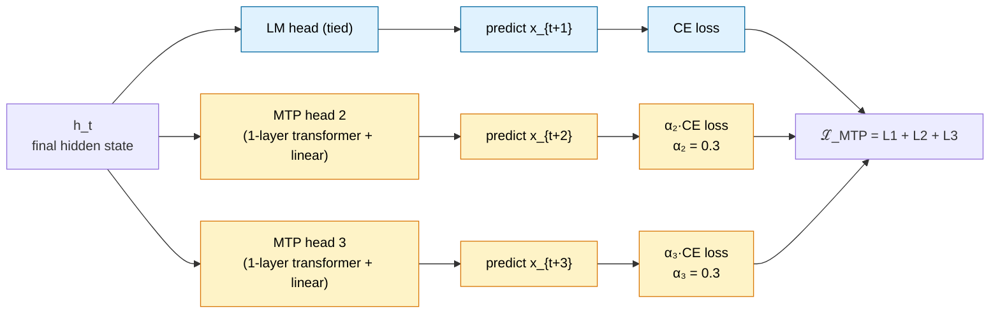
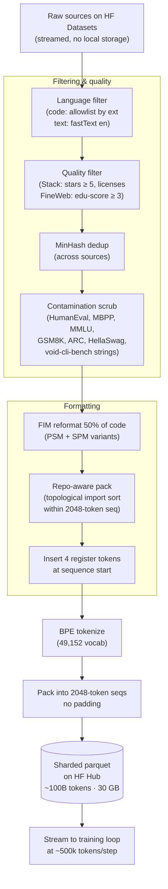
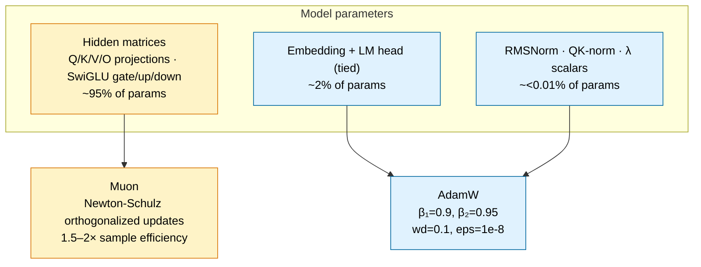
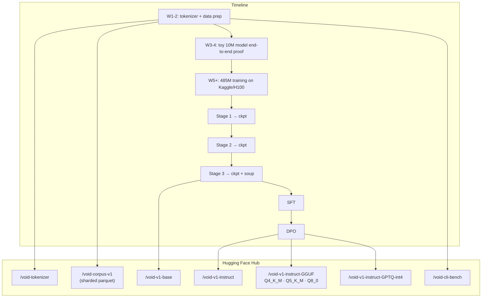

# void_v1 — Architecture & Design

**Model:** `void_v1`
**Parameters:** ~485M (dense, decoder-only)
**Domain:** Code generation + command-line reasoning
**Status:** Design-phase (pre-training)
**Companion paper:** [`paper/void_v1.tex`](../paper/void_v1.tex)

---

## 1. Executive Summary

`void_v1` is a 485M-parameter decoder-only language model designed to be trained from scratch on ~100B tokens of a curated code+general corpus, targeting competitive performance with published sub-1B code models (Qwen2.5-Coder-0.5B, DeepSeek-Coder-1.3B) while planting one research flag: **Differential Attention at the sub-1B scale**, a mechanism proposed by Microsoft Research in late 2024 that has not yet appeared in any released model of this size.

The design combines seven proven-in-2024 techniques (deep-narrow scaling, GQA, RoPE with extended θ, mixed sliding-window/full attention, Multi-Token Prediction, register tokens, QK-normalization, Muon optimizer, FIM training) with the single novel component. Every non-standard component has a documented rollback path — the model can gracefully degrade to a standard Llama-family baseline if any specific bet underperforms.

---

## 2. System Overview

---

## 3. Architecture at a glance

| Property | Value | Reference |
|---|---|---|
| Parameter count | 485M (485,120,640 by exact count) | This document |
| Layers | 32 | MobileLLM depth bias |
| Hidden dim | 960 | MobileLLM |
| Query heads | 15 | — |
| KV heads | 5 (GQA 3:1) | Llama-3 style |
| Head dim | 64 | — |
| FFN inner | 2560 (SwiGLU, ratio 2.67×) | Llama family |
| Vocab | 49,152 | SmolLM tokenizer style |
| Context | 2048 (extensible to 32k via RoPE) | — |
| RoPE θ | 500,000 | Llama-3 recipe |
| Norm | RMSNorm (ε=1e-5) | Llama family |
| Norm placement | pre-norm on attn + FFN | Llama family |
| Activation | SwiGLU | Shazeer 2020 |
| QK-norm | yes, on both diff-attn branches | Chameleon / ViT-22B |
| **Attention** | **Differential GQA (2 Q + 2 K projs)** | **Ye et al. 2024 — NOVEL AT THIS SCALE** |
| Attention pattern | mixed: full ⋈ SW-512 (see §5) | Mistral / Gemma-2 |
| Register tokens | 4 (learned, no supervision) | Darcet 2024 |
| MTP heads | 2 (t+2, t+3, train-only) | DeepSeek-V3 |
| Tied embeddings | yes | GPT-2 onwards |
| Bias in linear | none | Llama family |
| Dropout | 0 | Modern LLM default |
| Init | 𝒩(0, 0.02), residual projs × 1/√(2L) | Llama family |

---

## 4. Transformer block

Every block is pre-norm. Every attention layer is **Differential GQA**. Every FFN is **SwiGLU**. Some layers use sliding-window attention (see §5 for the pattern).

**Novelty highlighted in amber** — everything else is standard Llama-family.

**Cost of Differential Attention vs. standard GQA:**
- Parameters: `+d·(H·d_h + H_kv·d_h) = 960·(960+320) ≈ +1.23M` per layer (2 extra projections)
- Total added: ~39M params across 32 layers = **~8% of total model size**
- FLOPs: attention scores computed twice = roughly **+15-20% attention compute**
- Rollback: set `W_{Q₂} = W_{K₂} = 0` at init and pin `λ = 0` → collapses to standard GQA

---

## 5. Mixed attention pattern

Not all layers use full attention. This reduces per-token attention FLOPs by ~40% at S=2048 while keeping enough full-attention layers for long-range integration.

```mermaid
gantt
    title Attention pattern per layer (1 = full, 0 = sliding-window 512)
    dateFormat X
    axisFormat %s
    section Layers 1-4 (full)
    Full   :done, l1, 0, 1
    Full   :done, l2, 1, 2
    Full   :done, l3, 2, 3
    Full   :done, l4, 3, 4
    section Block 1 (SW,SW,SW,Full)
    SW-512 :active, l5, 4, 5
    SW-512 :active, l6, 5, 6
    SW-512 :active, l7, 6, 7
    Full   :done, l8, 7, 8
    section Block 2
    SW-512 :active, l9, 8, 9
    SW-512 :active, l10, 9, 10
    SW-512 :active, l11, 10, 11
    Full   :done, l12, 11, 12
    section Blocks 3-5 (repeat)
    SW/SW/SW/Full :active, l13, 12, 24
    section Layers 25-32 (full)
    Full   :done, l25, 24, 32
```

**Layer distribution:**
- Full attention: layers 1–4, 8, 12, 16, 20, 24, 25–32 → **12 layers**
- Sliding-window (512): layers 5–7, 9–11, 13–15, 17–19, 21–23 → **20 layers**

---

## 6. Multi-Token Prediction heads (train-only)

**Blue** = kept at inference. **Amber** = discarded after training. The MTP heads share the LM head weight matrix (tied) so their parameter cost is only the 1-layer transformer preceding each — ~2M params each, ~4M total.

---

## 7. Data pipeline

---

## 8. Training curriculum

Three stages with distinct data mixes, LR schedules, and objectives.

```mermaid
flowchart LR
    subgraph S1["Stage 1 · 85B tokens · ~85%"]
        M1["Broad mix<br/>Stack 55 · FineWeb-Edu 20<br/>Cosmopedia 10 · Math 5<br/>Issues/SE 5 · Wiki 5"]
        LR1["LR: 0 → 3e-4 (warmup 2k)<br/>then cosine → 3e-5 by end of S3"]
        OBJ1["Objective: MTP loss<br/>(main CE + α·MTP heads)"]
    end
    subgraph S2["Stage 2 · 10B tokens · ~10%"]
        M2["Quality anneal<br/>Stack 60 · Cosmopedia 20<br/>Math 15 · rest 5"]
        LR2["LR: cosine decay continues"]
        OBJ2["Same MTP loss"]
    end
    subgraph S3["Stage 3 · 5B tokens · ~5%"]
        M3["High-quality only<br/>Cosmopedia + top-tier Stack"]
        LR3["LR: → near zero"]
        OBJ3["MTP loss + β·KL(teacher ‖ student)<br/>Teacher: Qwen2.5-Coder-7B<br/>β = 0.5, T = 2"]
    end
    SOUP["Model soup<br/>mean(last 3 ckpts)"]
    BASE(("void-v1-base"))

    S1 --> S2 --> S3 --> SOUP --> BASE

    subgraph POST["Post-training"]
        SFT["SFT · 100k instruction pairs<br/>self-oss-instruct + Hermes + no_robots<br/>ChatML format · 3 epochs"]
        DPO["DPO · 30k preference pairs<br/>UltraFeedback-clean<br/>β = 0.1"]
    end
    INST(("void-v1-instruct"))

    BASE --> SFT --> DPO --> INST
```

**Fail-fast gates:**
- @ 20B tokens: HumanEval must be ≥ 8 (SmolLM2-360M level with 50× tokens). If not → halt and diagnose.
- @ 50B tokens: HumanEval must be ≥ 15 (SmolLM2-1.7B level).
- @ 85B tokens: end of Stage 1, HumanEval must be ≥ 22.
- @ 100B tokens: target ≥ 25 (see §11 for full expected range).

---

## 9. Optimizer split

**Rollback:** if Muon diverges, one config flip moves all hidden matrices to AdamW.

---

## 10. Compute & memory budgets

Derived rigorously in [`paper/void_v1.tex`](../paper/void_v1.tex) §3.7. Summary:

| Quantity | Value | Notes |
|---|---|---|
| Forward FLOPs per token (train) | 8.4 × 10⁸ | includes MTP heads |
| Forward FLOPs per token (inference) | 8.1 × 10⁸ | MTP discarded |
| Train FLOPs per token (fwd + bwd ≈ 3×) | ~2.5 × 10⁹ | |
| Total FLOPs for 100B tokens | 2.5 × 10²⁰ | |
| Kaggle TPU v3-8 wall-clock | ~386 hrs = ~4.5 months @ 20h/wk | infra path A |
| Rented H100 spot wall-clock | ~175 hrs = ~1 week | ~$350–700 |
| Peak train memory (bf16) | ~10 GB | fits Kaggle T4×2 or 24 GB GPU |
| KV cache (S=2048, batch=1) | 168 MB | GQA 3:1 savings |
| Model on disk (bf16) | 970 MB | |
| Model quantized (GGUF Q4_K_M) | ~290 MB | |

---

## 11. Theoretical comparison

Reference numbers from published model cards; **void_v1** column is **expected** given the training recipe of §8. See [`paper/void_v1.tex`](../paper/void_v1.tex) §7 for the derivation of expected ranges.

| Feature | Pythia-410M | MobileLLM-350M | SmolLM2-360M | Qwen2.5-Coder-0.5B | DeepSeek-Coder-1.3B | **void_v1** |
|---|---|---|---|---|---|---|
| Params (M) | 410 | 350 | 362 | 494 | 1300 | **485** |
| Layers | 24 | 30 | 32 | 24 | 24 | **32** |
| Hidden | 1024 | 960 | 960 | 896 | 2048 | **960** |
| GQA ratio | 1 (MHA) | 3 | 3 | 7 | 1 (MHA) | **3** |
| RoPE θ | 10k | 10k | 10k | 1M | 10k | **500k** |
| Attention pattern | full | full | full | full | full | **mixed SW/full** |
| QK-norm | ❌ | ❌ | ❌ | ❌ | ❌ | **✅** |
| Differential attention | ❌ | ❌ | ❌ | ❌ | ❌ | **✅ (NEW)** |
| MTP heads | ❌ | ❌ | ❌ | ❌ | ❌ | **✅ (2)** |
| Register tokens | ❌ | ❌ | ❌ | ❌ | ❌ | **✅ (4)** |
| FIM training | ❌ | ❌ | ❌ | ✅ | ✅ | **✅** |
| Optimizer | AdamW | AdamW | AdamW | AdamW | AdamW | **Muon + AdamW** |
| Training tokens | 300B | 1T | 4T | 5.5T | 2T | **100B target** |
| Distillation | ❌ | ❌ | ❌ | ❌ | ❌ | **✅ Stage-3 from Qwen2.5-C-7B** |
| **HumanEval pass@1** | 2.4 | 8.6 | 12.8 | **40.5** | 34.8 | **25–32 (expected)** |
| **MBPP pass@1** | ~3 | — | 15.6 | **40.4** | 55.6 | **25–32 (expected)** |
| **MMLU** | 25.7 | 25.7 | 24.7 | 30.5 | — | **28–32 (expected)** |
| **HellaSwag** | 40.6 | 49.6 | 54.6 | 55.5 | — | **50–55 (expected)** |

### What this comparison shows

1. **No published sub-1.3B model uses any of** Differential Attention, MTP heads, register tokens, or QK-norm. void_v1 is the first to combine all four at this size.
2. **Only Qwen2.5-Coder and DeepSeek-Coder use FIM.** They also invest 20–55× more training tokens than we plan to.
3. **We are the only model in the size class using the Muon optimizer.** This is one of our two big bets (differential attention being the other) for closing the training-token gap.
4. **Our expected HumanEval range (25–32)** is below Qwen2.5-Coder-0.5B (40.5) — this is honest. We cannot match a model trained on 55× more tokens with just architecture tricks. But we should decisively beat SmolLM2-360M (12.8), MobileLLM-350M (8.6), and Pythia-410M (2.4), placing void_v1 as **the #2 open sub-1B code model** behind Qwen2.5-Coder-0.5B.

---

## 12. Novelty statement (what's ours, what's not)

**Genuinely novel to void_v1:**
- Differential Attention at ≤ 1B params (published only at 3B+ scale in Ye et al.)
- The specific combination of all seven Tier-1/Tier-2 techniques
- void-cli-bench, a new eval benchmark for command-line reasoning

**Standard components (drawn from published models):**
- Deep-narrow scaling (MobileLLM)
- GQA (Llama-2 / Llama-3)
- RoPE θ=500k (Llama-3)
- Mixed sliding-window/full attention (Mistral / Gemma-2)
- MTP heads (DeepSeek-V3)
- Register tokens (Darcet et al., 2024)
- QK-norm (Chameleon, ViT-22B)
- Muon optimizer (Keller Jordan)
- FIM training (Codex / DeepSeek-Coder / Qwen-Coder)
- Three-stage annealing curriculum (SmolLM2)
- Teacher distillation (Gemma-2)

**We do not claim novelty for the base transformer architecture, the training recipe as a whole, or the data mixture.** These are refinements of published practice.

---

## 13. Risk register & rollbacks

| Component | Failure mode | Rollback path |
|---|---|---|
| Differential Attention | Training diverges or plateaus by 20B tokens | Set `W_{Q₂} = W_{K₂} = 0` at init, freeze `λ = 0` → collapses to standard GQA. Ships as `void-v1-standard`. |
| Multi-Token Prediction | Aux loss dominates or destabilises | Set `α₂ = α₃ = 0`; heads discarded. |
| Register tokens | No measurable benefit @ 20B tokens | Drop 4 positions from every seq; retrain from ckpt with adjusted position IDs. |
| Muon optimizer | NaN loss or instability | Swap to pure AdamW at any checkpoint — parameter update change only. |
| Mixed attention | Long-range failure on evals | Convert all SW layers to full → +40% attention FLOPs, no other change. |
| Teacher distillation | Teacher too different, destabilises Stage 3 | Drop the KL term; Stage 3 reduces to standard CE on Cosmopedia. |
| Kaggle account issues | Rate limit / policy trip | Fallback to alt Kaggle account; HF Hub is source of truth. |
| Compute exhaustion | Free tier runs out mid-training | Ship the best available checkpoint + honest partial-training model card. |

**No scenario produces "spent 3 months and shipped nothing."** Every phase ships something valuable independently.

---

## 14. Release plan

Three artifacts published to Hugging Face Hub:

Each artifact includes:
- Full model card with training recipe
- Provenance for every training data source
- Contamination check results
- Full eval numbers (including failed / disappointing ones — no cherry-picking)
- Reproducibility instructions

---

## 15. Research bet (one sentence)

> **Does Differential Attention improve code-generation quality at 485M parameters when trained on a code-specialized 100B-token corpus with Stage-3 distillation from Qwen2.5-Coder-7B, versus an otherwise-identical standard GQA baseline?**

Answering this question — with real numbers, whichever way it points — is the primary research contribution of void_v1.

---

## 16. What to read next

- **Full research paper (with proofs):** [`paper/void_v1.tex`](../paper/void_v1.tex)
- **ADR-0001 (architecture decision, coming):** to be written before implementation begins
- **ADR-0002 (Differential Attention research bet, coming):** codifies the falsifiable claim and rollback contract
- **Data pipeline spec (coming):** exact filter thresholds, source URIs, dedup parameters
- **Training runbook (coming):** step-by-step Kaggle/H100 execution

*This document is the canonical architecture reference. All implementation code and subsequent decisions must be consistent with the choices recorded here; any deviation requires an ADR update.*
